# Vertretungsapp. - Installations-Anleitung

## Inhaltsverzeichnis

1. [Android](#android)
2. [iOS](#ios)

## Android

### 1. Öffne deinen Browser und gehe auf [vertretungsapp.de](https://www.vertretungsapp.de)

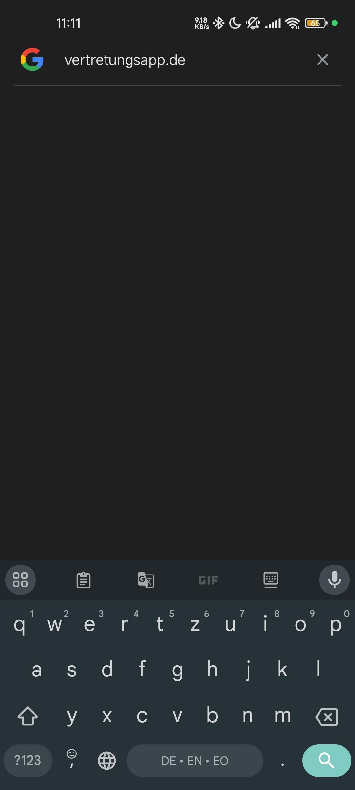

### 2. Starte die Vertretungsapp über den Button "Zur App"

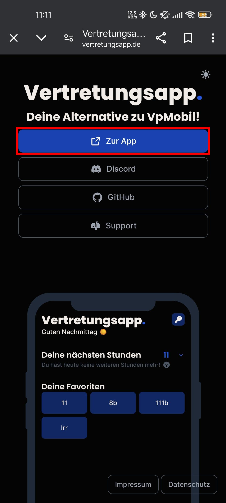

### 3. Öffne das Kontextmenü deines Browsers (Drei-Punkte-Menü)

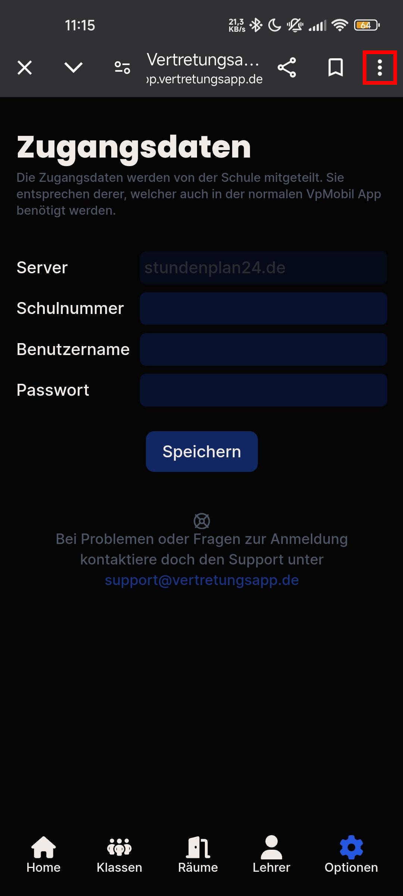

### 4. Wähle "Zum Startbildschirm hinzufügen" aus

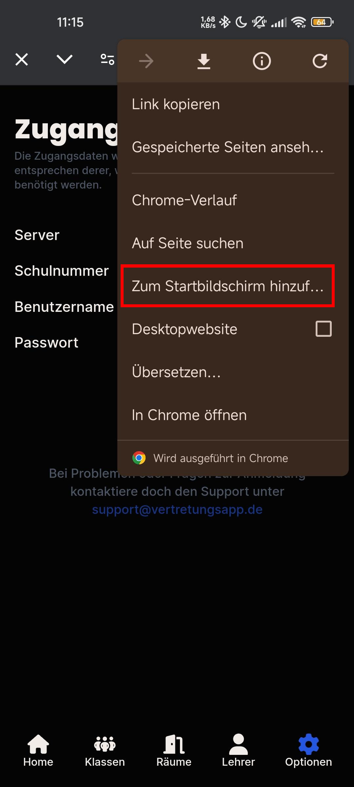

### 5. Wähle "Installieren" aus

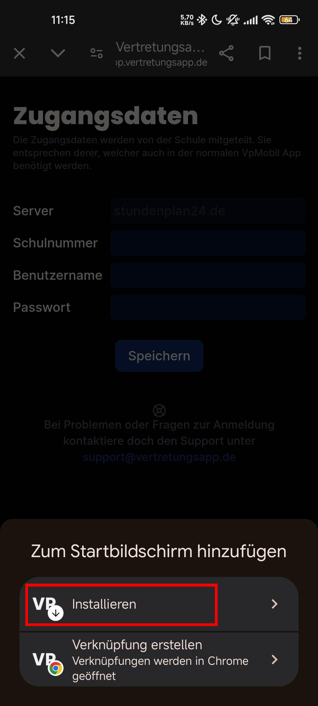

### 6. Bestätige die Installation durch "Installieren"

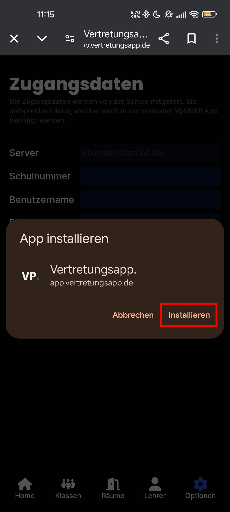

### 7. Die Vertretungsapp. wurde erfolgreich installiert und befindet sich auf deinem Startbildschirm 🎉

## iOS

### 1. Öffne Safari und gehe auf [vertretungsapp.de](https://www.vertretungsapp.de)

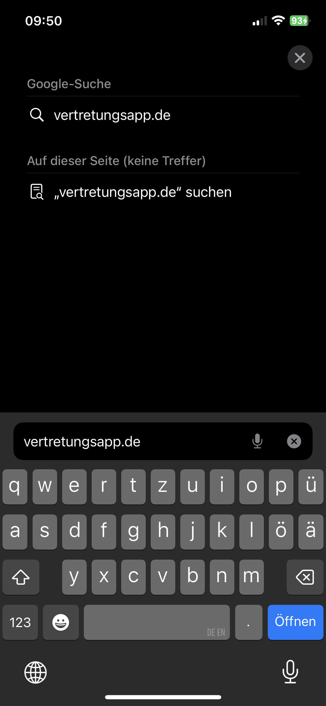

### 2. Starte die Vertretungsapp über den Button "Zur App"

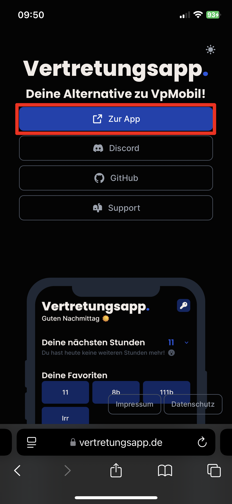

### 3. Öffne das Teilen-Menü (Quadrat mit Pfeil nach oben)

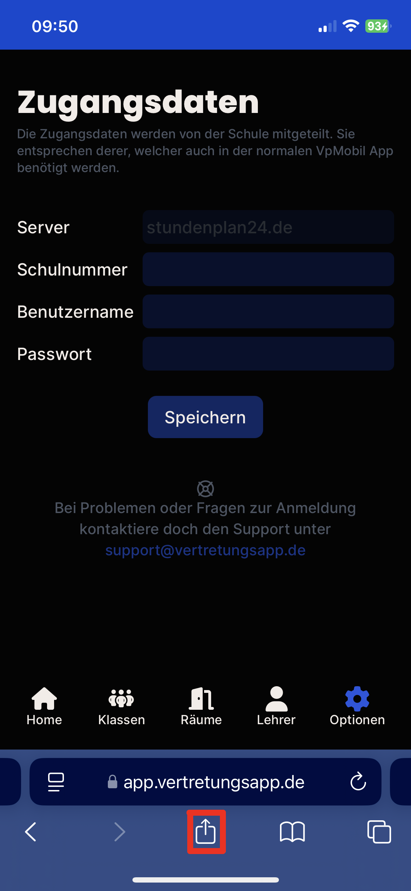

### 4. Wähle "Zum Home-Bildschirm" aus

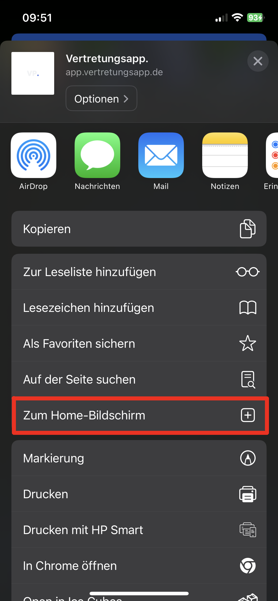

### 5. Bestätige die Installation durch "Hinzufügen"

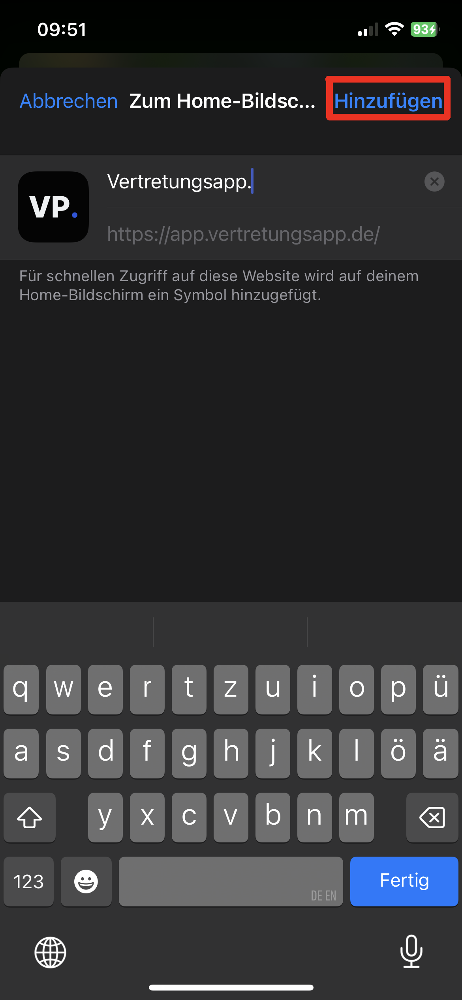

### 6. Die Vertretungsapp. wurde erfolgreich installiert und befindet sich auf deinem Home-Bildschirm 🎉

---

Credits: [annhilati](https://github.com/annhilati) (Android), [SachsenspieltCoding](https://github.com/SachsenspieltCoding/) (iOS)
