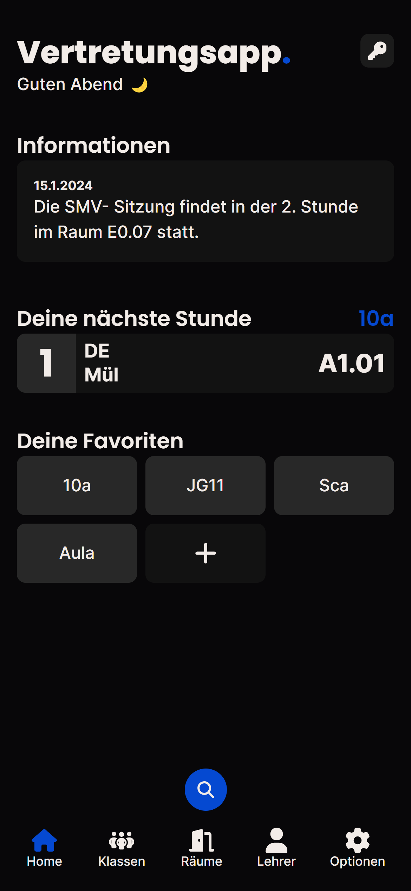
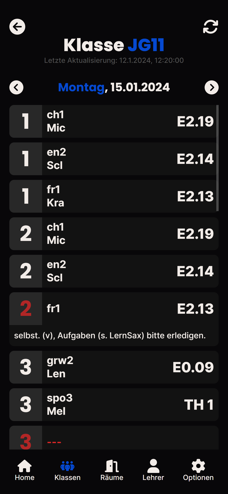
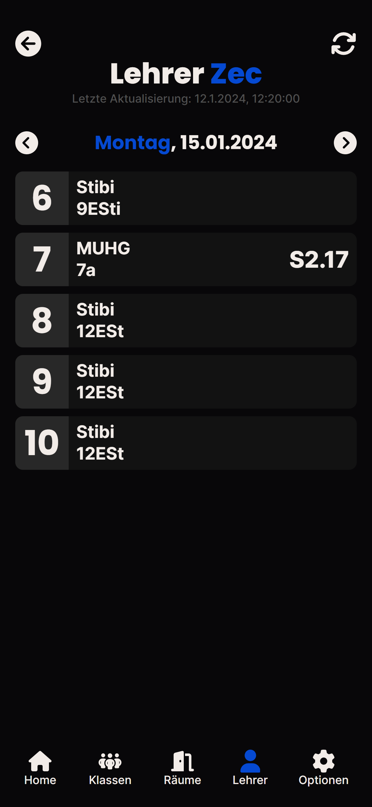
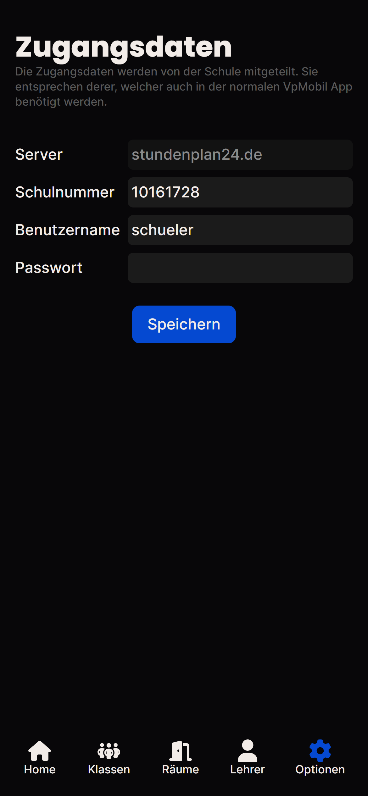

# 📱 Vertretungsapp.

Deine Vertretungsplanapp für Indiware!
Indiware ist eine Stundenplanungssoftware, welche primär an Sächsischen Gymnasien zum Einsatz kommt.
Diese App ersetzt somit die offizielle App VpMobil24.

## Features

✨ Abrufen von Vertretungsplänen  
✨ Raumpläne  
✨ Lehrerpläne  
✨ Filtern von Stunden  
✨ Favoriten  
✨ Umfangreicher Homescreen  
✨ Suchfunktion  
✨ Suche freie Räume  

## Das funktioniert (noch) nicht

❌ Eigene Indiware Instanzen (nur stundenplan24.de möglich)  
❌ Lehrerzugang mit Aufsichten etc.  

## Screenshots

    
    
    
    

## Open Source ❤️

Das Projekt ist mittels GPLv3 lizenziert und für alle Contributions offen!

## Rechtliches

Die App und seine zugehörigen Dienste und Projekte sind eigenständig und stehen in keiner Verbindung zu Indiware, der VpMobil24 App oder der Kannenberg Software GmbH. Die Nutzung obliegt der Verantwortung des Nutzers. Der Entwickler übernimmt keine Haftung für Schäden, die durch die Nutzung der App entstehen.
